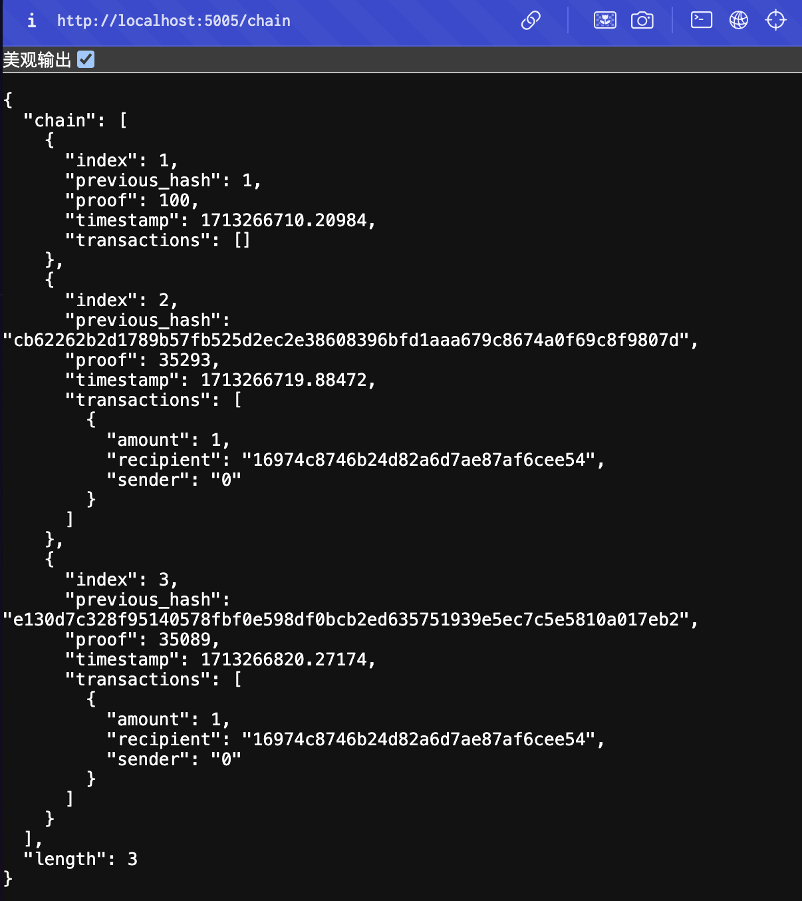
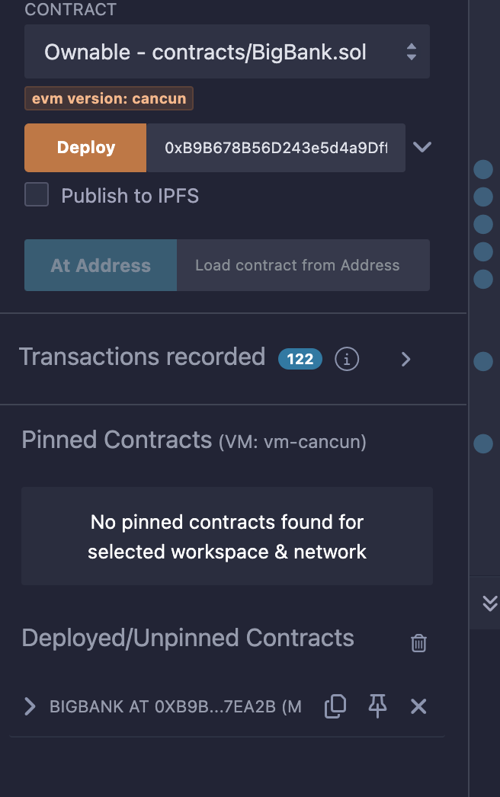
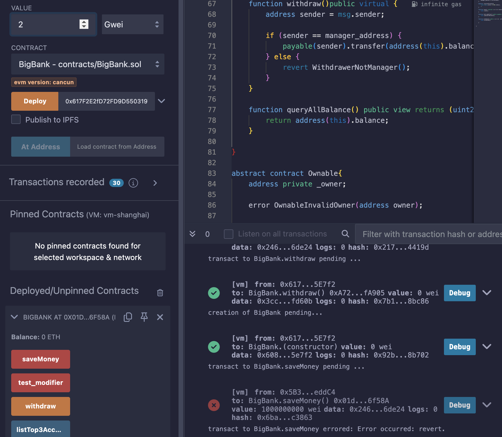
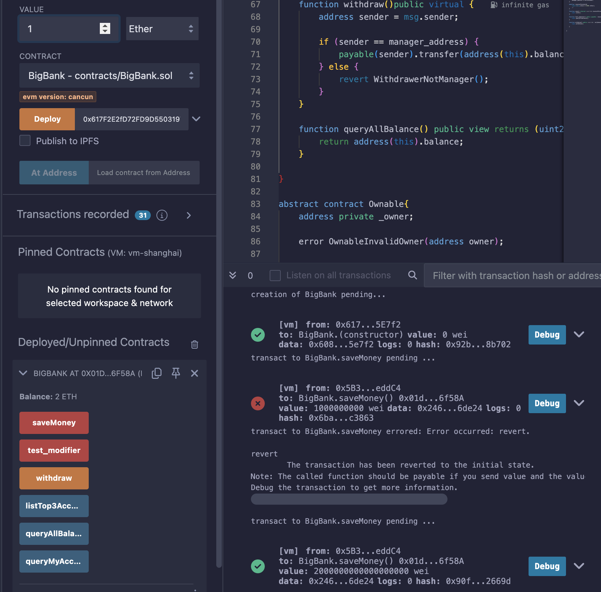
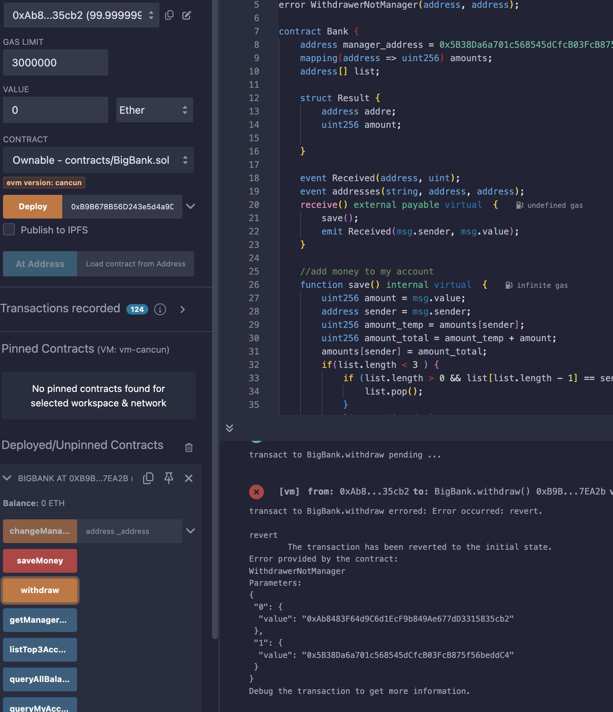
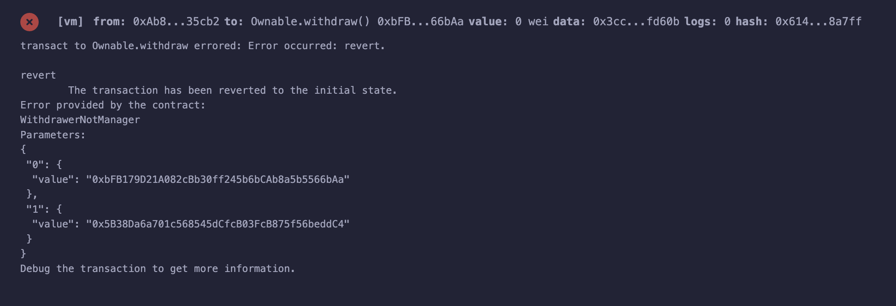
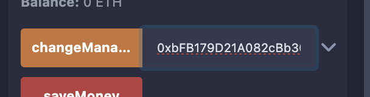
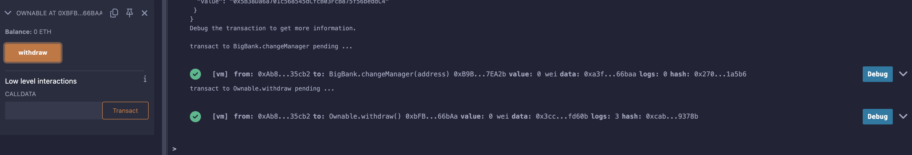

#### build a mini blockchain by python
```python
python blockchain.py
```

mine endpoint: http://localhost:5005/mine
full chain endpoint: http://localhost:5005/chain



step1: deploy Ownable with BigBank address


step2: call method with litter eth, will revert


step3: call method with 1 eth, will success


step4: 0xAB call withdraw will occur error


step5: try to use ownable call bigbank withdraw,occur error


step6: change manager address then call withdraw from ownable


